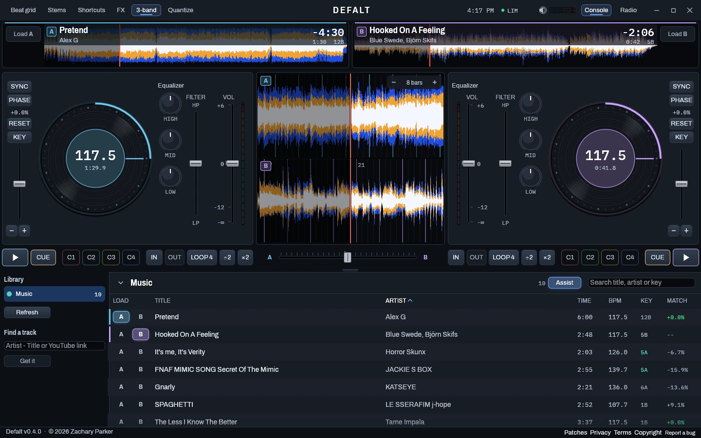
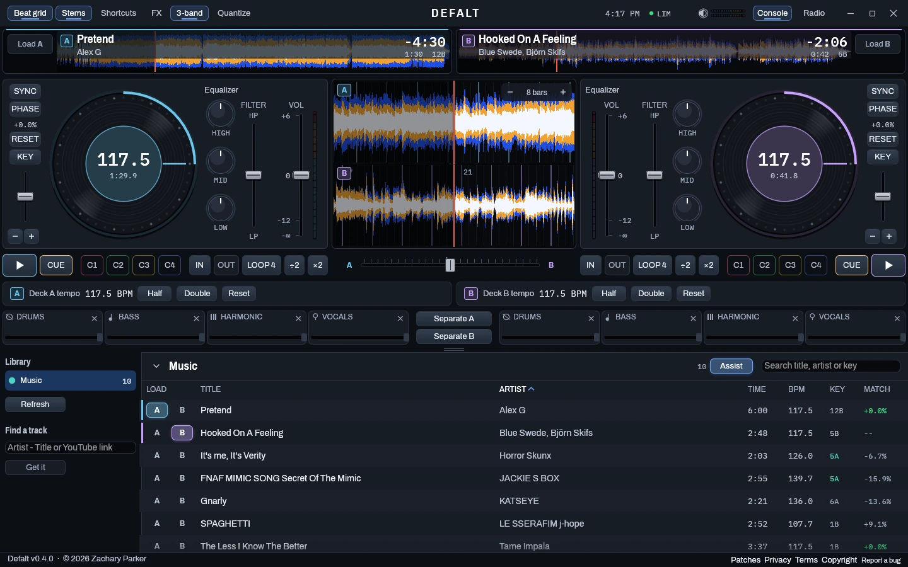
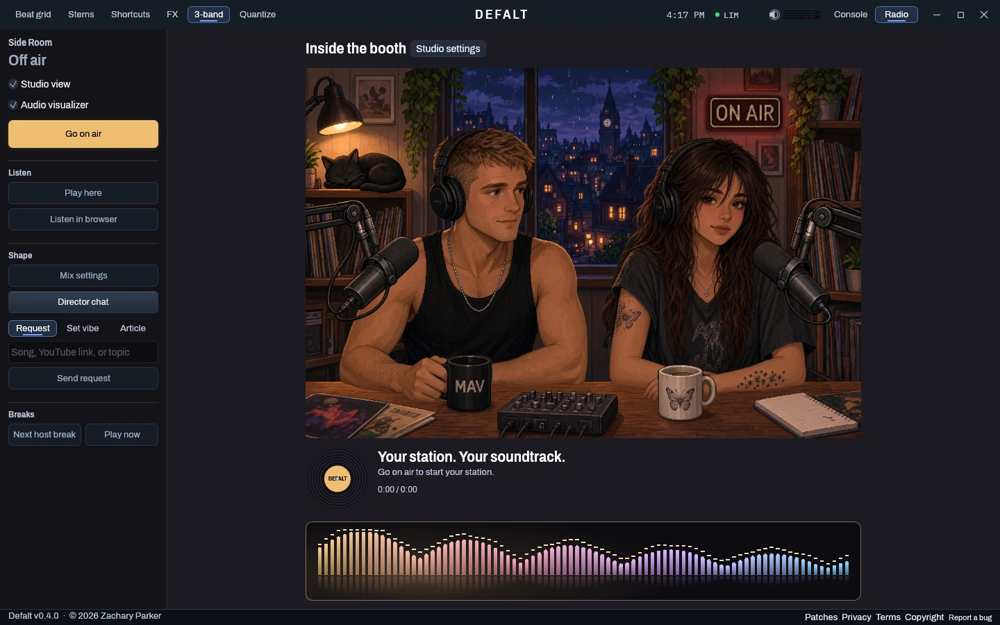

# Defalt

*named after the DJ. spelt wrong on purpose*

a DJ app for when i want to mix something myself, and a radio station for when
i just want to leave music on. two decks, a local library, and two hosts (Mav
and Rue) who have way too much to say about what i'm listening to



the console is Rust with egui and cpal. the radio brain is Python. it all runs
locally on Windows, and the only way in from outside is your own tunnel if you
set one up

current release is **0.4.5**. [patch notes](CHANGELOG.md) ·
[privacy](PRIVACY.md) · [terms](TERMS.md) · [license](LICENSE) ·
[copyright](COPYRIGHT.md). those same pages open from the app footer without
stopping the music

## what it does

**the decks**

- two decks with 3-band waveforms (lows blue, mids amber, highs white), hot
  cues, loops, quantize, sync and phase sync
- pitch-preserving key lock, a real 3-band isolator EQ, filter sweeps, echo and
  reverb sends that actually ring out, and a limiter on the master
- channel meters on every deck and a master meter up top, so you're not gain
  staging by vibes
- stems: split a record into drums, bass, harmonic and vocals and ride them
  separately
- the library folds out of the way when you're mixing. drag the divider or hit
  **Ctrl+L**



**the radio**

- it plays through those same decks, prepares every mix ahead of time and marks
  the mix points on the waveforms. **Skip** jumps to just before the next one
- 17 transition styles, from plain blends to echo outs, loop rolls, spinbacks,
  reverb washes and stem swaps, all landing on the phrase. **Creativity** in Mix
  settings decides how much it shows off. more in [Transitions](docs/TRANSITIONS.md)
- song choice looks at genre, artist, key, energy and what you've been skipping,
  and plans a few songs ahead. requests always win
- synced lyrics come from LRCLIB in the background. the current line shows
  under the deck and on the radio, the waveform gets verse/chorus bands, and
  the mixes stop cutting choruses in half. more in [Lyrics](docs/LYRICS.md)
- Mav and Rue talk between songs, roast your picks, read the news and do fake
  ads. they know what day and time it is and they remember running bits
- **Director chat** is the private line to the station: "keep this energy but
  less rap", "less talking for twenty minutes", "queue songs from 2010-2015",
  "some 90s R&B", "give the hosts a sarcastic ad about gaming news". "go back to
  normal" undoes a direction
- **Request** is for a one-off (a song, an artist, a YouTube link, a topic).
  **Set vibe** is for something it should stick with, like "studying, calm and
  jazzy"



**the other stuff**

- a browser version of the radio, and a phone version you can install to your
  home screen that streams the console's real mix. see [Remote listening](docs/REMOTE.md)
- **Report a bug** (F8) saves what you saw, the station state and the logs from
  around that moment into `reports/`. see [Feedback](docs/FEEDBACK.md)
- it opens with the OBBY STUDIO intro in a little window, then the console comes up
  behind it. click to skip, or set it to once a day or off under Startup video
  in the Patches window

the hosts need a language model and text to speech. the decks don't need
either. Spotify is only used for search and metadata, it's never the audio

## run it

you need Python 3.11+, a current Rust toolchain, the MSVC C++ build tools, and
`ffmpeg` / `ffprobe` on PATH

```powershell
python -m venv .venv
.venv\Scripts\python.exe -m pip install -r requirements.txt
Copy-Item .env.example .env
```

put your own keys in `.env`:

- OpenRouter is optional. without it the hosts use fallback lines
- Spotify search needs `SPOTIFY_CLIENT_ID` and `SPOTIFY_CLIENT_SECRET`
- Steam stuff needs `STEAM_API_KEY` and `STEAM_ID`

check the setup, import some music, start the console:

```powershell
.venv\Scripts\python.exe -m radio.cli doctor
.venv\Scripts\python.exe -m radio.importer "E:\Music"
cargo run --release
```

hit **Refresh** after importing, pick a record and load it onto A or B.
**Shortcuts** has the whole keyboard map. open **Radio** and hit **Go on air**
to start the station. you can load a record or two first or let it pick

to build it for real and put a shortcut on the desktop (it runs every test
first):

```powershell
powershell -ExecutionPolicy Bypass -File tools\ship.ps1
```

close Defalt before you do that or it can't replace the exe

coming from 0.3.x? run this once so your songs get the new key, energy and
phrase data:

```powershell
.venv\Scripts\python.exe -m radio.cli reanalyse
```

coming from 0.4.2 or older? 0.4.3 adds one package (ytmusicapi, for spotting
explicit versions), so run the pip install line above again. without it
everything still works, it just can't tell a clean upload from the explicit one

the browser radio is `.venv\Scripts\python.exe -m radio`, then open the address
it prints (port `8090` by default)

## make it yours

- **Mix settings** has transition timing, EQ, filters, echo, speech levels,
  song choice and how mean the hosts are allowed to be
- `config/station.yaml` holds the defaults, `config/overrides.yaml` holds your
  local changes
- `config/personas/` is who Mav and Rue are and what they sound like
- `config/news.yaml` and `config/games.yaml` run the news and Steam segments

the database, cached audio and the Obsidian vault never go in git. the vault
keeps track history, artist notes, sessions and transcripts, and anything under
a `## Notes` heading survives regeneration

read [NOTICE.md](NOTICE.md) for how audio is handled and what gets sent where

more docs: [radio and mixing](docs/RADIO.md) ·
[requests and the API](docs/REQUESTS.md) · [song references](docs/MEME-REFERENCES.md) ·
[writing backends](docs/WRITING-BACKENDS.md)

## still rough

- verse and chorus only come from synced lyrics, so a song LRCLIB doesn't
  have (or an instrumental) still only gets the acoustic guesswork
- lyric matching for song choice only uses whatever text is embedded in the
  files
- the browser player can't do key lock, fakes stem swaps and turns spinbacks
  into brakes. stream mode plays the console's real mix instead
- the new energy and similarity data were checked on test signals, not tuned by
  ear yet
- the hosts are only as good as the model and voice provider. a failed request
  means fallback lines
- longer set planning still needs work

## development

Python schedules the station and prepares audio. Rust loads the decks, follows
the schedule and does all the audio work on the device callback, including
every transition

one command per suite:

```powershell
.venv\Scripts\python.exe -m unittest discover -s tests -t .
node tests/run-browser.js
cargo test --bin defalt -- --skip soundcheck
```

- the Python audio tests need FFmpeg. tests never read your `.env`, so they
  can't make live calls
- soundcheck needs a real output device, so it's skipped above
- node needs no packages. `node tests/run-browser.js studio` runs only the
  files matching a word
- `tools\ship.ps1` runs all three before it builds (`-SkipTests` to skip) and
  CI runs them on every push

`requirements.lock` pins the exact versions it's developed against (Python
3.12+). yt-dlp stays unpinned on purpose since it has to keep up with the sites

the browser studio uses WebP sprites cut from the desktop art in
`web/static/studio-v2`. if you change that art, rebuild them with
`.venv\Scripts\python.exe tools\build-web-art.py`

third-party audio code and its licenses are in [vendor/README.md](vendor/README.md)

## legal

the boring but important part. the short version: it's my code, you can look
at it and run it for yourself, it comes with no warranty, and what you download
and play with it is on you

- [LICENSE](LICENSE): source available, all rights reserved. look, build, run
  it for yourself, but no copying, reselling or reuploading without asking
- [terms](TERMS.md): the no warranty and liability stuff, the flashing lights
  and volume warnings, and the rules for third party services
- [privacy](PRIVACY.md): what stays on your machine and what gets sent where
- [copyright](COPYRIGHT.md): trademarks and how to send a takedown
- [third party notices](THIRD-PARTY-NOTICES.md): every crate, package and font
  and its license. it's generated, rerun `tools\third-party-notices.py` after
  changing dependencies
- [security](SECURITY.md): report holes privately, not in an issue
- [NOTICE.md](NOTICE.md): how audio is handled, in plain words

the app asks you to accept the terms the first time you open it (and again if
they change). License, Notices and the rest are in the footer

---
Defalt v0.4.5 · © 2026 Zachary Parker
